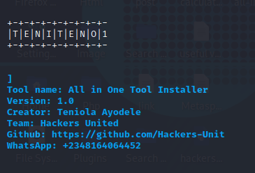
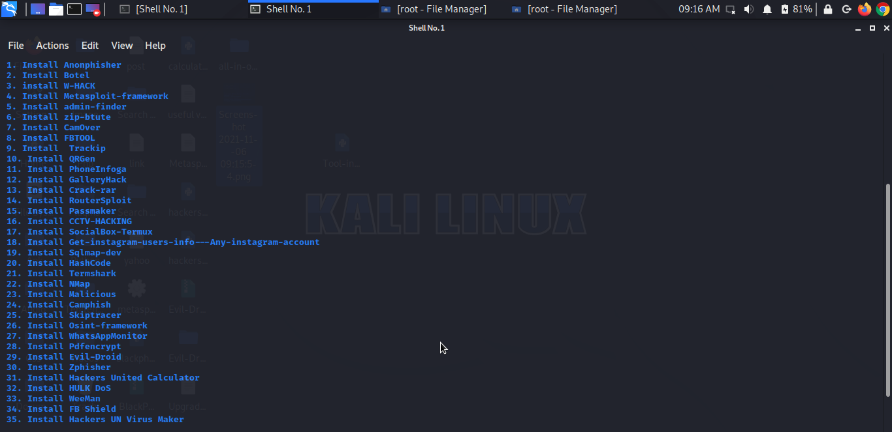

<!DOCTYPE html>
<html>
<head>
<body>
<h1>All in One:</h1>

All in One is a python script which helps in Installing other Python Tools and Packages With just a Click

<h2>INSTALLATION AND USAGE:</h2>

$ apt update

$ apt upgrade

$ apt install python3

$ apt install git

$ git clone https://github.com/Hackers-Unit/All-in-One

$ cd All-in-One

$ python3 all-in-one.py

<h2>SCREENSHOT:</h2>

<h2>NOTE:</h2>

Follow me on github for more tools

</body>
</head>
</html>
